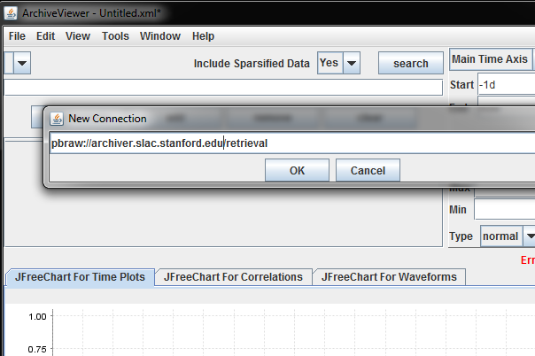
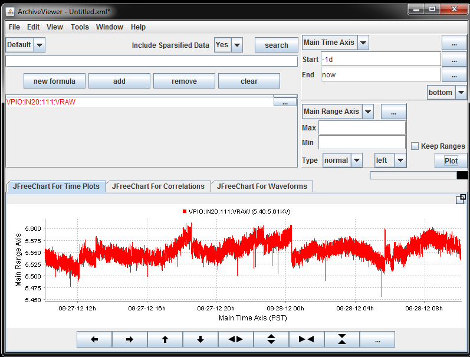

::::: container-fluid
::: navbar-header
[The EPICS Archiver Appliance](index.html){.navbar-brand}
:::

-   [News](https://github.com/slacmshankar/epicsarchiverap/wiki)
-   [Details](details.html)
-   [Download](https://github.com/slacmshankar/epicsarchiverap/releases/)
-   [Quickstart](quickstart.html)
-   [Installation](installguide.html)
-   [User Guide](userguide.html)
-   [Customize](customization.html)
-   [Developers](developersguide.html)
-   [Admin](admin.html)
-   [Javadoc](api/index.html)
-   [Issues](https://github.com/slacmshankar/epicsarchiverap/issues)
-   [FAQ](faq.html)
-   [License](license.html)

<!-- -->

-   {style="margin-top: -45px"}

:::::

:::: container
::: section
### Retrieving data using the ArchiveViewer

The EPICS Archiver Appliance comes with a client plugin for the
ArchiveViewer that enables the user to retrieve and display data in the
ArchiveViewer using the [PB/HTTP](pb_pbraw.html) protocol. To download a
version of the Archive Viewer with the client plugin for the EPICS
Archiver Appliance, please see the
[Download](https://github.com/slacmshankar/epicsarchiverap/releases/)\'s
section.

To retrieve data, start the Archive Viewer and connect to the EPICS
Archiver Appliance using a URL that looks like so
`pbraw://archiver.slac.stanford.edu/retrieval`. This URL is generated by
replacing the string *http* with the string *pbraw* in the
`data_retrieval_url` element of your `appliances.xml`.

{.img-responsive}

Once you have established a connection to the server, you should be able
to use the Archive Viewer as before to retrieve and display data.

{.img-responsive}

The Archive Viewer is also used to retrieve data from the Channel
Archiver; this has a concept of indexes that form part of the data
retrieval request. There is no equivalent concept in the EPICS Archiver
Appliance; so we have a dummy client-side only entry called *Default*
that is used.
:::
::::
